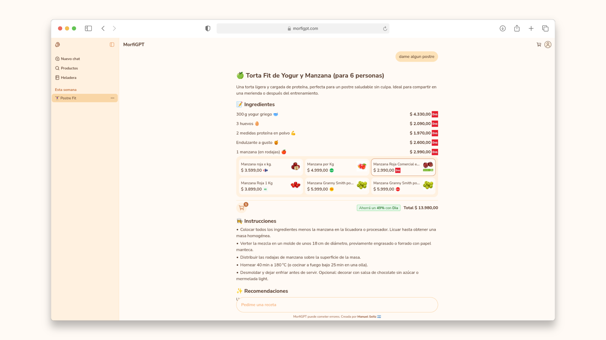
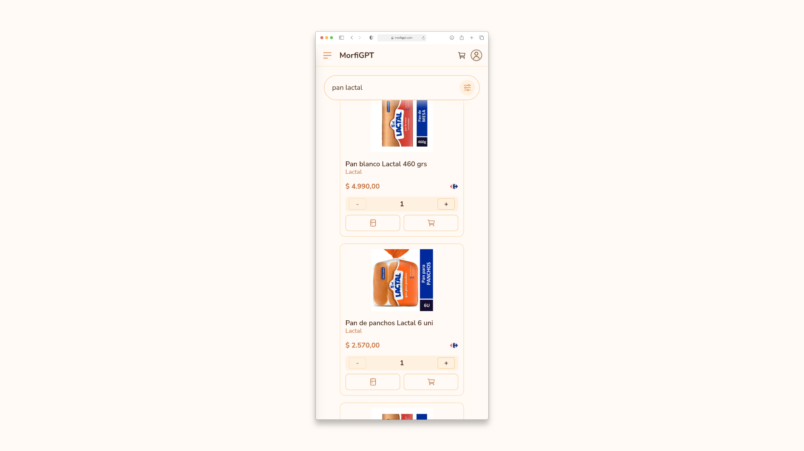

# MorfiGPT

  

**MorfiGPT** es una aplicación web que ayuda a responder la clásica pregunta de _“¿Qué comemos hoy?”_.  
Ofrece recomendaciones de recetas oficiales de cocineros argentinos, junto con instrucciones detalladas, sugerencias y videos para facilitar cada preparación.

## Necesidad, problema y solución

Decidí crear esta app para no complicarme pensando **qué comer** y **cuánto gastar**. Al principio opté por usar **ChatGPT**, pero resultó ser incapaz de procesar precios o recomendar productos de supermercados argentinos, por lo que desarrollar una herramienta personalizada iba a ser una mejor solución.
MorfiGPT actúa como un **asistente de cocina** que recomienda recetas previamente almacenadas y verificadas, y responde a cualquier duda planteada. Junto con la receta, calcula el mejor precio en relación a los supermercados disponibles.  
Tomé como inspiración lo realizado en el proyecto [ratoneando.ar](https://github.com/matiasbontempo/ratoneando-go) para obtener toda la información de los supermercados más populares del país. Es importante aclarar que todos los productos y precios se encuentran **actualizados** a la fecha.

  

